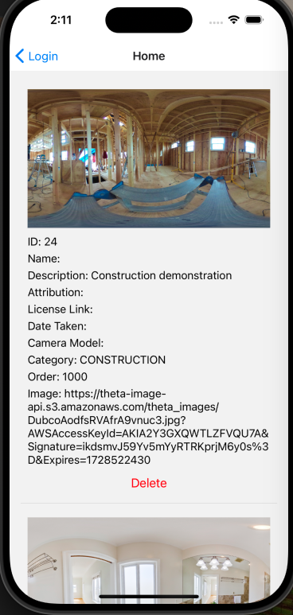

# Using JSON Web Token from iOS and Android with React Native



Be aware that images uploaded to the server are automatically published
publicly.  Do not upload
private images.

## Running Locally

```text
npm install
npm start
```

### For Android

```bash
# using npm
npm run android
```

### For iOS

```bash
# using npm
npm run ios
```

## API Authentication Information

username: tutorial
password: theta360DotGuide

Do not upload private images.  This is a public playground for testing.

## Troubleshooting

[Unable to load contents of file list](https://stackoverflow.com/questions/55505991/xcode-10-2-update-issue-build-system-error-1-unable-to-load-contents-of-file-l)

```text
pod deintegrate
pod install
```

## Article: Setting Up Django for Secure 360 Image Management with JWT

[JSON Web Token](https://en.wikipedia.org/wiki/JSON_Web_Token)
(JWT) is a standard for transmitting information securely.
JWT is used to display, upload and delete information from an
API server.

To run a REST command such as display image or delete image using JWT, your
application must first request a JWT token from the backend server.

To serve a REST API with JWT authentication using Django, you need the packages
`djangorestframework` and `djangorestframework-simplejwt`.

The packages will handle token generation, security, and REST management.

Here's a step-by-step guide on how to set it up:

1. Set up Django and Django REST Framework (DRF)
First, ensure you have a Django project set up with Django REST Framework (DRF) installed:

```bash
pip install django djangorestframework
```

Add 'rest_framework' to your INSTALLED_APPS in settings.py:

```python
INSTALLED_APPS = [
    # Other apps...
    'rest_framework',
]
```

2. Install Django REST Framework Simple JWT
For JWT-based authentication, install the djangorestframework-simplejwt package:

```bash
pip install djangorestframework-simplejwt
```

Then, add rest_framework_simplejwt to your INSTALLED_APPS:

```python
INSTALLED_APPS = [
    # Other apps...
    'rest_framework_simplejwt',
]
```

3. Configure JWT Authentication in settings.py
Update the REST_FRAMEWORK settings to use JWT for authentication:

```python
REST_FRAMEWORK = {
    'DEFAULT_AUTHENTICATION_CLASSES': (
        'rest_framework_simplejwt.authentication.JWTAuthentication',
    ),
    'DEFAULT_PERMISSION_CLASSES': (
        'rest_framework.permissions.IsAuthenticated',
    ),
}
```

4. Create JWT Views for Token Handling
In your urls.py file, set up paths for obtaining and refreshing tokens:

```python
from django.urls import path
from rest_framework_simplejwt.views import (
    TokenObtainPairView,
    TokenRefreshView,
)

urlpatterns = [
    path('api/token/', TokenObtainPairView.as_view(), name='token_obtain_pair'),
    path('api/token/refresh/', TokenRefreshView.as_view(), name='token_refresh'),
]
```

TokenObtainPairView: Returns an access token and refresh token.
TokenRefreshView: Refreshes the access token using the refresh token.

5. Creating a Simple API View
Now, you can create a simple API view that requires authentication:

```python
from rest_framework.views import APIView
from rest_framework.response import Response
from rest_framework.permissions import IsAuthenticated

class ProtectedAPIView(APIView):
    permission_classes = [IsAuthenticated]

    def get(self, request):
        return Response({"message": "You are authenticated!"})
```

Then, add this view to your urls.py:

```python
urlpatterns = [
    path('api/protected/', ProtectedAPIView.as_view(), name='protected'),
    # JWT token paths
    path('api/token/', TokenObtainPairView.as_view(), name='token_obtain_pair'),
    path('api/token/refresh/', TokenRefreshView.as_view(), name='token_refresh'),
]
```

6. Using the API
To authenticate, you'll first obtain a JWT token by sending a POST request to /api/token/ with valid user credentials (e.g., username and password). The response will include an access token (for authorization) and a refresh token (for getting a new access token when it expires).

```bash
POST /api/token/
{
  "username": "your_username",
  "password": "your_password"
}
```

You'll get a response like:

```json
{
  "refresh": "your_refresh_token",
  "access": "your_access_token"
}
```

Then, include the access token in the Authorization header when making requests to protected endpoints:

```makefile
Authorization: Bearer your_access_token
```

7. Token Expiration and Refreshing
When the access token expires, you can refresh it using the refresh token by sending a POST request to /api/token/refresh/:

```bash
POST /api/token/refresh/
{
  "refresh": "your_refresh_token"
}
```

You'll receive a new access token in the response.

8. Optional: Customizing Token Payload or Expiration
You can also customize JWT behavior in settings.py. For example, to modify the token expiration time:

```python
from datetime import timedelta

SIMPLE_JWT = {
    'ACCESS_TOKEN_LIFETIME': timedelta(minutes=5),
    'REFRESH_TOKEN_LIFETIME': timedelta(days=1),
    # other settings...
}
```

### Next Steps

You now have a Django application serving a REST API with JWT authentication. You can create additional views and restrict access using the JWT token. For more advanced use cases, you can further customize the JWT payload, token lifetime, and authentication logic.

### Try Out Live Servers

#### Oppkey API Developer Demonstration Server

You can access the APIs for the Oppkey Django server here:

<https://image360.oppget.com/api/>

The username and password for the API server will be put into the forum:

<https://community.theta360.guide/>

This [example](https://github.com/PhatCa/reactNativeTheta360/blob/8b5954db3a41d73bb8fc4475fe850b4ebf752d99/App.tsx#L83) shows how to use a token.

```javascript
const response = await fetch('https://image360.oppget.com/api/user-photo/', {
method: 'GET',
headers: {
    'Authorization': `Bearer ${accessToken}`,
    'Content-Type': 'application/json',
},
});
```
